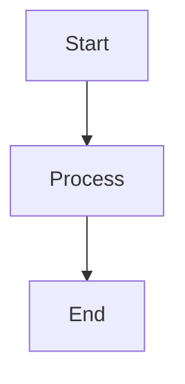

<!-- Auto-generated by Claude on 2025-06-02 06:15 -->

# SuperFences Extension Documentation

## Overview

The SuperFences extension is a modification of Python Markdown's standard Fenced Code Extension. It provides enhanced support for nested fenced code blocks within blockquotes, lists, and other contexts, while also supporting custom fence types for special content like UML diagrams.

## Purpose

- **Enhanced Nesting**: Allows fenced code blocks to be properly rendered inside blockquotes, lists, and other nested contexts
- **Custom Fences**: Supports special fence types beyond standard code blocks (e.g., flow charts, sequence diagrams)
- **Flexible Configuration**: Provides extensive customization options for code highlighting and formatting
- **Tab Preservation**: Optional preservation of tabs in code blocks

## Key Components

### Core Classes

#### `SuperFencesCodeExtension`
The main extension class that configures and registers the SuperFences functionality.

**Configuration Options:**
- `disable_indented_code_blocks`: Disable standard indented code blocks
- `custom_fences`: Define custom fence types with validators and formatters
- `css_class`: Set CSS class for wrapper elements
- `preserve_tabs`: Preserve tabs in fences instead of converting to spaces
- `relaxed_headers`: Allow more flexible fence headers

```python
# Example usage
extension = SuperFencesCodeExtension(
    disable_indented_code_blocks=False,
    preserve_tabs=True,
    custom_fences=[
        {
            'name': 'mermaid',
            'class': 'mermaid',
            'format': custom_formatter
        }
    ]
)
```

#### `SuperFencesBlockPreprocessor`
The main preprocessor that identifies and processes fenced code blocks.

**Key Methods:**
- `search_nested()`: Searches for and processes nested fenced blocks
- `eval_fence()`: Evaluates normal fence content
- `eval_quoted()`: Handles fences within blockquotes
- `highlight()`: Applies syntax highlighting using Pygments

#### `CodeStash`
A utility class for temporarily storing processed code blocks.

**Methods:**
- `store(key, code, indent_level)`: Store code with metadata
- `get(key, default)`: Retrieve stored code
- `remove(key)`: Remove code from stash
- `clear_stash()`: Clear all stored code

### Formatter Functions

#### `fence_code_format()`
Default formatter for standard code blocks. Wraps content in `<pre><code>` tags.

```python
def fence_code_format(source, language, class_name, options, md, **kwargs):
    # Returns formatted HTML for code blocks
    return '<pre><code class="language-python">...</code></pre>'
```

#### `fence_div_format()`
Alternative formatter that wraps content in `<div>` tags instead of `<pre><code>`.

### Validator Functions

#### `highlight_validator()`
Validates options for syntax highlighting, including:
- `hl_lines`: Lines to highlight
- `linenums`: Line numbering configuration
- `title`: Code block title

#### `default_validator()`
Basic validator that accepts all input attributes.

## Regular Expressions

The extension uses several complex regex patterns:

- `RE_NESTED_FENCE_START`: Matches the start of fenced code blocks with language and options
- `RE_HL_LINES`: Validates highlight line specifications
- `RE_LINENUMS`: Parses line numbering options
- `RE_OPTIONS`: Extracts key-value options from fence headers

## Usage Examples

### Basic Fenced Code Block
```markdown
```python
def hello():
    print("Hello, World!")
```
```

### Code Block with Options
```markdown
```python hl_lines="1 3" linenums="1"
def hello():
    print("Hello, World!")
    return True
```
```

### Custom Fence Type
```markdown

```

## Configuration Notes

### Custom Fences
When defining custom fences, provide:
- `name`: The fence identifier
- `class`: CSS class for the output
- `format`: Custom formatter function (optional)
- `validator`: Custom validator function (optional)

### Performance Considerations
- The extension uses a two-pass approach to handle nested contexts correctly
- Code blocks are temporarily stashed and may be restored if processing was too aggressive
- Tab preservation requires additional preprocessing passes

### Integration with Other Extensions
- Works with the `attr_list` extension for additional attributes
- Integrates with `pymdownx.highlight` for advanced syntax highlighting
- Compatible with blockquote and list extensions

## Error Handling

The extension includes robust error handling:
- `SuperFencesException`: Custom exception for fence processing errors
- Graceful fallback when custom validators fail
- Restoration of original content when processing is too aggressive

## Notes and Suggestions

1. **Performance**: For large documents with many code blocks, consider the performance impact of the nested processing algorithm

2. **Custom Validators**: When creating custom validators, ensure they handle edge cases and malformed input gracefully

3. **CSS Styling**: The extension generates semantic HTML - ensure your CSS handles the various class combinations properly

4. **Tab Handling**: The `preserve_tabs` option affects the entire document processing - use carefully

5. **Compatibility**: Test thoroughly when combining with other Markdown extensions, especially those that modify code block processing