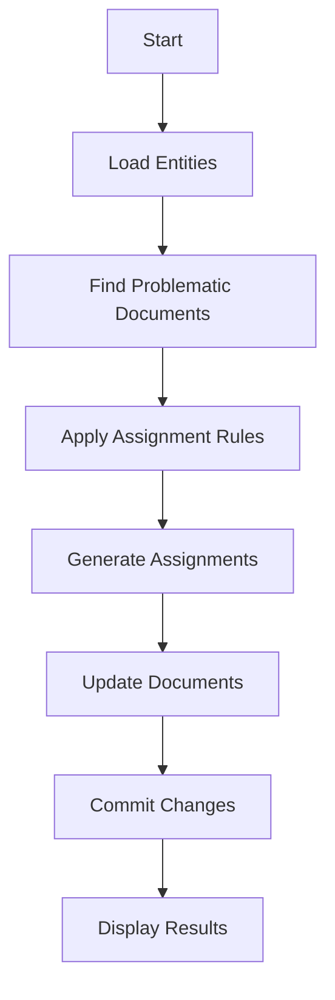

<!--
This documentation was auto-generated by Claude on 2025-05-31T15-57-05.
Source file: ./src/backend/fix_tenant_automation.py
-->

# Tenant Automation Fix Script

## Overview

This script fixes tenant automation by automatically assigning documents to matching tenants based on content analysis and predefined rules. It identifies problematic documents that lack proper tenant assignment and applies intelligent matching logic to associate them with the appropriate entities.

## Prerequisites

- Python 3.7+
- SQLAlchemy with async support
- aiosqlite for SQLite async operations
- Access to the application models (`Document` and `Entity`)

## Installation

Ensure the following dependencies are installed:

```bash
pip install sqlalchemy[asyncio] aiosqlite
```

## Usage

Run the script directly from the command line:

```bash
python3 fix_tenant_automation.py
```

## Script Functionality

### Main Components

#### Database Connection
- Creates an async SQLite engine using `aiosqlite`
- Connects to `./documents.db`
- Uses SQLAlchemy's async session management

#### Entity Management
- Retrieves all available entities from the database
- Creates a lookup dictionary for efficient entity matching
- Displays available entities with their IDs, aliases, and names

#### Document Processing
- Identifies problematic documents with missing or invalid recipient information
- Targets documents where `recipient` is:
  - `NULL`
  - Empty string
  - "Your Company"
  - "Unknown"

### Assignment Rules

The script applies intelligent assignment logic based on content analysis:

| Rule | Trigger Conditions | Target Entity | Description |
|------|-------------------|---------------|-------------|
| **Rule 1** | "google" in sender, title, or content | Google entity | Google service documents |
| **Rule 2** | "andré", "personal", "medical", or "insurance" keywords | Personal entity | Personal/medical documents |
| **Rule 3** | "test company", "office", "rent", or "test corp" keywords | Test Corp entity | Company/business documents |

### Processing Workflow



## Functions

### `fix_tenant_automation()`

**Purpose**: Main function that orchestrates the tenant assignment process.

**Parameters**: None

**Returns**: None

**Process**:
1. Establishes database session
2. Loads all entities into memory
3. Queries for problematic documents
4. Applies assignment rules based on content analysis
5. Updates document records with new tenant assignments
6. Commits changes to database
7. Provides detailed output of operations performed

## Output Format

The script provides comprehensive console output:

```
🔧 Fixing Tenant Automation
========================================
👥 Available Entities:
  1: Google (Google Services)
  2: Personal (Personal Documents)
  3: Test Corp (Test Corporation)

📄 Found 15 documents to fix:
  📄 Google Drive Notification        → Google (Google service detected)
  📄 Medical Insurance Form           → Personal (Personal document detected)
  📄 Office Rent Agreement           → Test Corp (Company document detected)
  ❓ Unknown Document                 → No assignment found

🎯 Applying 12 assignments...
  ✅ Google Drive Notification → Google
  ✅ Medical Insurance Form → Personal
  ✅ Office Rent Agreement → Test Corp

✅ Tenant automation fixed!
   📊 12 documents assigned to tenants
   🎯 3 documents still need manual review
```

## Database Schema Requirements

The script expects the following database structure:

### Document Table
```sql
- id: Primary key
- title: Document title
- content: Document content
- sender: Document sender
- recipient: Document recipient (updated by script)
- entity_id: Foreign key to Entity table (updated by script)
```

### Entity Table
```sql
- id: Primary key
- name: Entity full name
- alias: Entity short name/alias
```

## Error Handling

- Uses SQLAlchemy's transaction management with automatic rollback on errors
- Async context managers ensure proper resource cleanup
- Path configuration handles module imports from different locations

## Customization

To modify assignment rules, update the logic in the `fix_tenant_automation()` function:

```python
# Add new rule
elif "new_keyword" in content:
    assigned_entity = next((e for e in entities.values() if e.alias == "New Entity"), None)
    reason = "New rule applied"
```

## Performance Considerations

- Loads all entities into memory for efficient lookup
- Uses async operations for database queries
- Batch commits changes after processing all assignments
- Content analysis performed in-memory to minimize database calls

## Security Notes

- Database connection uses local SQLite file
- No external network connections required
- Operates on existing data without exposing sensitive information
- Uses parameterized queries through SQLAlchemy ORM