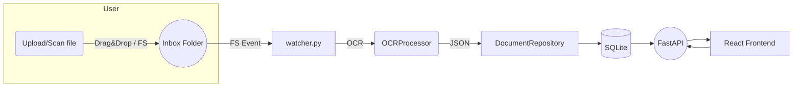

# Concept: Document Management System (DMS)

The Document Management System (DMS) is a local-first, privacy-preserving platform that helps individuals and small teams to organise, search and gain insights from their paperwork.

Key ideas:

1. **Unified Inbox** – every new file (PDF, image, email attachment, …) is dropped into a watch folder.  A background watcher automatically OCRs, classifies and stores the document in an SQLite database.
2. **Search like Google** – full–text index plus semantic search powered by an LLM allows natural-language queries such as *"electricity bills from last winter unpaid"*.
3. **Integrated Workflow** – invoices are synced to a Calendar (ICS export) and Notifications remind the user of due dates.
4. **Local AI** – by default all AI features (OCR with Tesseract, LLM with Ollama) run on-device; the system can fall back to cloud providers if configured.
5. **Extensible** – clean REST API (`/api`) exposes all functionality so the frontend (React + Tailwind) or external automations can interact with the repository.

## High-Level Architecture

* **Backend** – FastAPI + SQLAlchemy.  Core modules: `ocr.py`, `repository.py`, `search.py`, `analytics.py`, `notifications.py`.
* **Frontend** – React 18, TypeScript, Tailwind.  Two modes: component library with mocked data for rapid UI prototyping and an *Integrated* set wired to the REST API.
* **Worker** – `watcher.py` daemon monitors the inbox and triggers OCR + persistence.

## Data Flow

## Non-Goals

* Multi-tenant SaaS (focus is on local deployment)
* Real-time collaborative editing (single-user oriented for now)
* Heavy enterprise features (records management, retention policies…)

---

*Document generated automatically during code-review fix session.* 